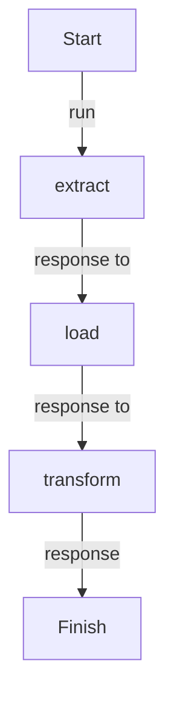

# ETL Flow

## Workflow

### Import

```python
from dotflow import DotFlow

from tasks.extract import extract
from tasks.load import load
from tasks.transform import Transform
```

### Instance

```python
workflow = DotFlow()
```

### Add

```python
workflow.task.add(
    step=[extract, Transform, load],
    initial_context="https://pythonfluente.com"
)
```

### Start

```python
workflow.start()
```

## Tasks

- extract
- load
- transform
  - text_html_parser
  - transform_to_dict
  - transform_model

---

<details>
<summary>Click to see diagram</summary>



</details>
