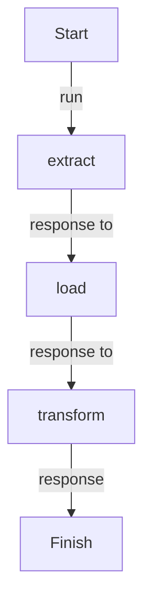

# ETL Flow

## Workflow

### Import

```python
from dotflow import DotFlow

from tasks.extract import extract
from tasks.load import load
from tasks.transform import Transform
```

### Instance

```python
workflow = DotFlow()
```

### Add

```python
workflow.task.add(
    step=[extract, Transform, load],
    initial_context="https://pythonfluente.com"
)
```

### Start

```python
workflow.start()
```

## Tasks

- extract
- load
- transform
  - text_html_parser
  - transform_to_dict
  - transform_model

---

<details>
<summary>Click to see diagram</summary>



</details>

## Docker

### Debian

```docker
FROM debian:bullseye-slim

RUN apt-get update && apt-get install -y python3 python3-pip

WORKDIR /app

COPY . .

RUN pip3 install --no-cache-dir -r requirements.txt

CMD ["python3", "main.py"]
```

### Ubuntu

```docker
FROM ubuntu:22.04

RUN apt-get update && apt-get install -y python3 python3-pip

WORKDIR /app

COPY . .

RUN pip3 install --no-cache-dir -r requirements.txt

CMD ["python3", "main.py"]
```

### Alpine

```docker
FROM python:3.12-alpine

WORKDIR /app

COPY . .

RUN pip install --no-cache-dir -r requirements.txt

CMD ["python", "main.py"]
```

### Fedora

```docker
FROM fedora:latest

RUN dnf install -y python3 python3-pip

WORKDIR /app

COPY . .

RUN pip3 install --no-cache-dir -r requirements.txt

CMD ["python3", "main.py"]
```

### Python

```docker
FROM python:3.12-slim

WORKDIR /app

COPY . .

RUN pip install --no-cache-dir -r requirements.txt

CMD ["python", "main.py"]
```

### AWS Lambda

```docker
FROM public.ecr.aws/lambda/python:3.12

WORKDIR /var/task

COPY . .

RUN pip install --no-cache-dir -r requirements.txt

CMD ["main.lambda_handler"]
```

- Building the Docker image

```bash
docker build -t dotflow --file dockerfile.lambda .
```

- Starting the Docker Container

```bash
docker run -p 9000:8080 dotflow
```

- Calling lambda function

```bash
curl -XPOST "http://localhost:9000/2015-03-31/functions/function/invocations" -d '{}'
```